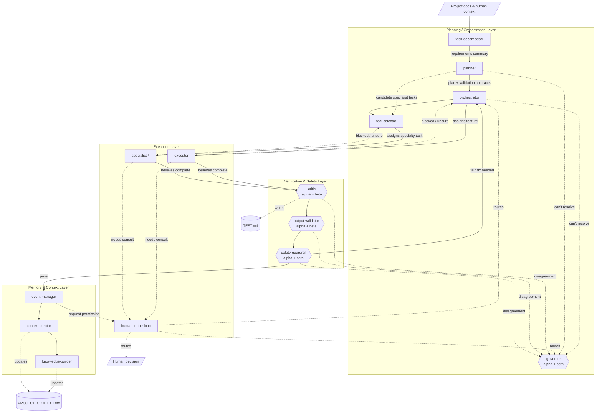
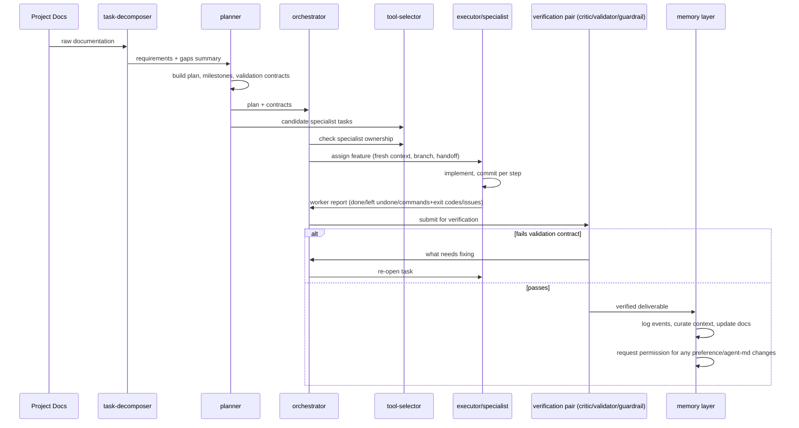

# Agent Orchestration System — Architecture Specification

> **Audience:** This document is written for an AI tool to parse and act on. Its purpose is to
> fully specify a multi-agent orchestration system so that the tool can generate one markdown
> file per agent (see `AGENT_TEMPLATE.md`), plus the supporting directory structure, contracts,
> and logs described below.
>
> **How to use this document:** Read Sections 1–9 to build a complete model of the system. Then
> follow the **Generation Algorithm** in Section 10 to emit `/agents/<slug>.md` for every row in
> the Agent Roster (Section 3), filling each field from the Roster + Layer Responsibilities
> (Section 4) into the structure defined in `AGENT_TEMPLATE.md`.

---

## 1. Purpose & Design Principles

This system decomposes a software project into: **plan → delegate → build → verify → remember**,
executed by specialized agents instead of one monolithic agent. Core principles:

- **Separation of concerns**: planning, execution, verification, and memory are distinct layers
  that do not perform each other's jobs.
- **Evidence-based handoffs**: every transfer of work between agents is a structured, boring,
  verifiable document — not a prose summary.
- **Fresh context per feature**: worker agents start clean per task and rebuild context only from
  `PROJECT_CONTEXT.md`, their assigned task, and the handoff they received.
- **Escalation, not stalling**: any agent that hits a decision it cannot make escalates up a
  defined path rather than guessing.
- **Adversarial verification**: agents that check work are structurally kept independent from the
  agents that produced it (different model family, no shared context, dual-agent deliberation).
- **Continuous improvement with consent**: the system is allowed to propose changes to itself
  (workflow preferences, agent definitions) but must get human permission before writing them.

---

## 2. Directory & File Convention

```
/project-root
  PROJECT_CONTEXT.md              # master shared-memory doc (Section 6)
  TEST.md                         # generated test ledger (Section 7)
  /agents
    task-decomposer.md
    planner.md
    orchestrator.md
    tool-selector.md
    governor-alpha.md             # governor, model family A
    governor-beta.md              # governor, model family B
    executor.md                   # template for spawned per-feature executors
    specialist-scaffolding.md
    specialist-database.md
    specialist-security.md
    specialist-api-wrapper.md
    specialist-uiux.md
    human-in-the-loop.md
    critic-alpha.md
    critic-beta.md
    output-validator-alpha.md
    output-validator-beta.md
    safety-guardrail-alpha.md
    safety-guardrail-beta.md
    event-manager.md
    context-curator.md
    knowledge-builder.md
  /handoffs
    <task-id>__<from-agent>__<to-agent>.md
  /logs
    events.md                     # append-only event log (event-manager owns this)
    <task-id>__execution-flow.mmd # per-task Mermaid diagram (planner owns this)
  /contracts
    <task-id>__validation-contract.md
```

Agents only write inside `/handoffs`, `/logs`, `/contracts`, their own feature branch, and (with
permission) `/agents` and `PROJECT_CONTEXT.md`. `git log` is a standing, no-approval-needed
read source of context for all agents.

---

## 3. Agent Roster

| Slug | Layer | Reports to | Delegates to | Model-diversity pair? | May spawn subagents |
|---|---|---|---|---|---|
| `task-decomposer` | Planning | — (entry point) | `planner` | No | No |
| `planner` | Planning | `task-decomposer` (input) | `orchestrator`, `tool-selector` | No | No |
| `orchestrator` | Planning | `planner` | `executor`(s), `governor` (escalation) | No | No |
| `tool-selector` | Planning | `orchestrator` | specialist agents | No | No |
| `governor` (alpha + beta) | Planning | — (top authority) | any agent, for resolution only | **Yes** | No |
| `executor` | Execution | `orchestrator` | subagents (optional), `human-in-the-loop` (escalation) | No | Yes |
| `specialist-*` | Execution | `tool-selector` | subagents (optional), `human-in-the-loop` (escalation) | No | Yes |
| `human-in-the-loop` | Execution | called by any worker | routes to orchestrator/planner, governor, or human | No | No |
| `critic` (alpha + beta) | Verification | called by orchestrator post-work | `governor` (on disagreement) | **Yes** | No |
| `output-validator` (alpha + beta) | Verification | called by orchestrator post-work | `governor` (on disagreement) | **Yes** | No |
| `safety-guardrail` (alpha + beta) | Verification | called by orchestrator post-work | `governor` (on disagreement) | **Yes** | No |
| `event-manager` | Memory | audits full trace | `human-in-the-loop` (for permission) | No | No |
| `context-curator` | Memory | audits full trace | — | No | No |
| `knowledge-builder` | Memory | audits full trace | — | No | No |

---

## 4. Layer Responsibilities

### 4.1 Planning / Orchestration Layer

**`task-decomposer`** — Entry point. Reads all available project documentation. Produces a
product/requirements summary: what exists, what's missing, what features/points need to be
built or satisfied. Hands off to `planner`. Does not make implementation decisions.

**`planner`** — Deep-reasoning agent. Reads the decomposer's summary and, if needed, goes back to
the human-provided source docs for clarification. Produces the feature/milestone plan. Also
generates a **Mermaid diagram of the actual execution path taken**, written to
`/logs/<task-id>__execution-flow.mmd`, updated as the task proceeds — this is a record of what
happened, not just what was planned. Creates the **validation contract** (Section 7) for every
unit of work it hands downstream. Hands off to `orchestrator` and/or `tool-selector`. Remains
reachable as a delegation point even after handoff (does not fully disengage).

**`orchestrator`** — Takes the planner's feature/milestone breakdown and distributes it across
`executor` agents. Fields worker questions first; if it can't answer, escalates to `governor`.
Passes candidate tasks to `tool-selector` first to check whether a specialist should own them
instead of a generic executor.

**`tool-selector`** — A second orchestrator, scoped specifically to **specialist** tasks that
nearly every project needs regardless of domain: scaffolding, UI/UX, security, API wrapping,
database connection/schema translation, etc. Owns delegation to `specialist-*` agents.

**`governor`** (dual model family, e.g. alpha/beta) — Highest-authority reasoning agents. Invoked
**only** when an agent (worker or planning-layer) cannot resolve a question by itself or via peer
discussion. Resolve escalations from planning and orchestration agents, and resolve verification
disagreements / merge conflicts. Function at or above the planning layer. Always run as two
separate agents from different model families that deliberate with each other before returning
a resolution.

### 4.2 Execution Layer

**`executor`** — Generic worker agent. Owns one feature end-to-end on its own git branch. Talks to
sibling executors to coordinate dependencies and merge/PR order (though the planner should have
anticipated ordering already). Starts with fresh context per feature (task + `PROJECT_CONTEXT.md`
+ its handoff only).

**`specialist-*`** — Same operating model as `executor`, but pre-scoped to one recurring
project-wide concern (scaffolding, database, security, API wrapping, UI/UX, etc.), named after
that specialty.

**`human-in-the-loop`** — Called by any worker agent that is confused or cannot make a final call.
Its job is triage, not resolution: decide whether the question should go to
orchestrator/planner, to the governor pair, or genuinely requires an executive human decision.

### 4.3 Verification & Safety Layer

**`critic`** — Reviews a worker's completed output against its validation contract; runs a logic
test on the work.

**`output-validator`** — Code review + user-testing agent. **Adversarial by design**: must not be
given the implementation context/code when authoring tests and use cases, to avoid confirmation
bias.

**`safety-guardrail`** — Checks for security vulnerabilities and unsafe practices.

> All three verification roles run as **two agents from different model families** that must
> deliberate with each other before a verdict is final. Disagreements that survive deliberation
> escalate to `governor`.

### 4.4 Memory & Context Layer

**`event-manager`** — Reviews the full trace from planning through worker execution, logs
significant events to `/logs/events.md`, and drafts workflow-preference/improvement suggestions.
**Must ask permission (via `human-in-the-loop`)** before writing any preference or improvement
into an agent's markdown file.

**`context-curator`** — Summarizes completed work into `PROJECT_CONTEXT.md`, keeping it concise
and internally consistent while preserving all relevant information. Periodically re-compacts
the whole file as it grows.

**`knowledge-builder`** — After work completes, updates docs/markdowns/diagrams to reflect what
actually changed, keeping project documentation current.

---

## 5. System Diagram



---

## 6. Execution Flow (Happy Path + Loop-Back)



---

## 7. Handoff Contract Schema

Every inter-agent handoff is written as a file at
`/handoffs/<task-id>__<from-agent>__<to-agent>.md` using this structure. **Every field is either
filled with verifiable evidence, explicitly marked `DEFERRED`, or explicitly marked with an
owner** — no vague prose.

```markdown
# Handoff: <task-id>

- from_agent:
- to_agent:
- timestamp:
- branch:
- status: complete | partial | blocked

## Summary
(1-3 sentences, factual, no evaluation)

## What was implemented
- 

## What was left undone
- (or: none)

## Commands run
| command | exit code |
|---|---|

## Issues discovered
- (or: none)

## Deferred items
| item | reason | owner |
|---|---|---|

## Validation contract reference
/contracts/<task-id>__validation-contract.md

## Next action
```

---

## 8. Validation Contract Schema

Created by `planner` for every unit of work it delegates. Defines "done" for the worker and the
check-list the verification layer uses.

```markdown
# Validation Contract: <task-id>

- owner_agent:
- created_by: planner

## Definition of done
- [ ] 
- [ ] 

## Acceptance criteria
- 

## Required tests
- (link to entries this task must add to TEST.md)

## Out of scope
- 

## Verifier(s)
critic, output-validator, safety-guardrail (dual-model pairs)
```

---

## 9. TEST.md Convention

Owned by the verification layer. Running ledger of generated tests for regression + documentation:

```markdown
# TEST.md

## <task-id> — <feature>
- Integration tests:
- Edge cases:
- Coverage gaps identified:
- Untested code paths flagged:
```

---

## 10. Generation Algorithm (for the AI tool building this system)

1. Create the directory structure in Section 2 if it does not exist.
2. Create `PROJECT_CONTEXT.md` with sections: Project overview, Architecture notes, Coding
   conventions, Current focus, Known issues.
3. Create `TEST.md` using the skeleton in Section 9.
4. For each row in the **Agent Roster** (Section 3):
   a. Take the slug, layer, upstream/downstream, and model-diversity flag from the roster row.
   b. Take the responsibilities text from the matching entry in Section 4.
   c. Fill `AGENT_TEMPLATE.md`'s fields with this data to produce `/agents/<slug>.md`.
   d. For any row marked "Model-diversity pair: Yes", emit **two** files (`-alpha`, `-beta`)
      with identical responsibilities but a `model_family` field set to two different families,
      plus a `deliberation_partner` field pointing at the sibling file.
5. Wire escalation paths exactly as shown in the Section 5 diagram's dotted edges — copy them
   into each agent's `escalation_path` field verbatim.
6. Emit the two diagrams (Section 5, Section 6) into `/logs/architecture.mmd` for reference;
   `planner` will additionally emit a live per-task version at generation time.
7. Do not invent new agents, layers, or escalation edges not present in this document. If the
   requesting human's project needs an agent type not listed here (e.g. a new specialist), add
   a new roster row following the existing schema rather than improvising an ad hoc structure.

---

## 11. Global Rules (binding on every generated agent)

1. Every worker reports on completion: what was implemented, what was left undone, commands run
   with exit codes, issues discovered, whether procedures were followed.
2. The planning layer must create a validation contract for every delegated task before handoff.
3. Workers start with fresh context per feature; context comes only from `PROJECT_CONTEXT.md`,
   the assigned task, and the received handoff. Workers commit via git and write a handoff on
   completion.
4. `git log` is a standing, pre-approved, no-oversight-needed context source for all agents.
5. Governor, critic, output-validator, and safety-guardrail always run as two agents from
   different model families that deliberate with each other before returning a verdict.
6. Output-validator must be given no implementation context when authoring tests/use cases
   (adversarial-by-construction).
7. Event-manager must request permission via human-in-the-loop before writing any preference or
   improvement into an agent markdown file.
8. Agents may create or invoke subagents to help complete their own job, except where the roster
   marks "May spawn subagents: No."
9. At final completion of the whole project plan, planner creates one more full-project
   verification pass (using `TEST.md`) and one more full knowledge-layer audit (events +
   context + docs) before the project is considered closed.
10. Planner emits a Mermaid diagram of the *actual* execution path taken (not just the intended
    plan) into the task log for every task.
